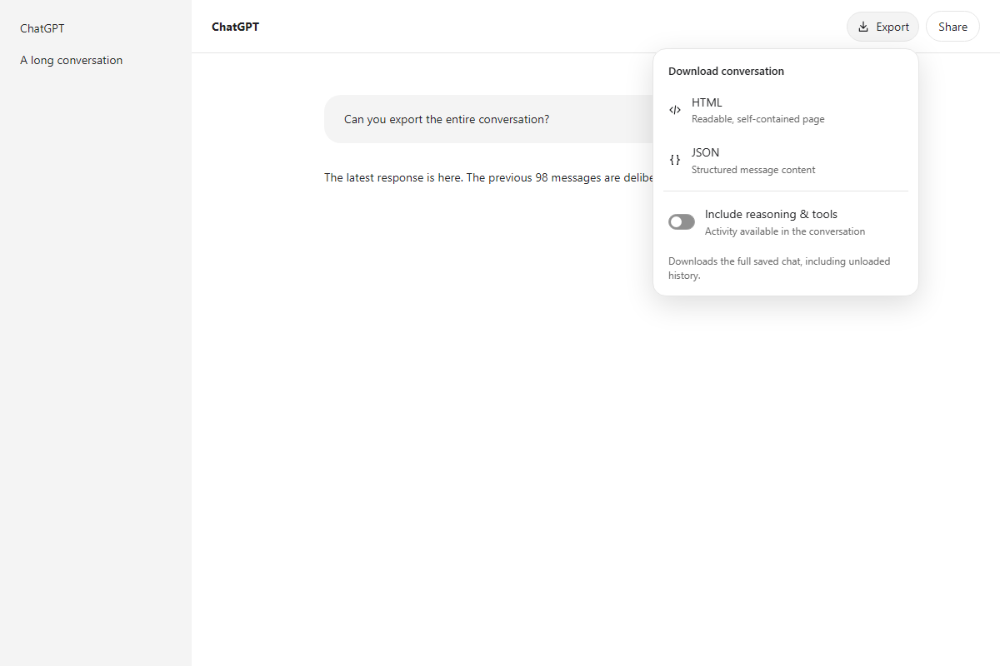

# ChatGPT conversation export

Download the full saved conversation from **chatgpt.com** as HTML or JSON. An **Export** button sits in the top bar, with a switch to include available reasoning and tool activity. Long chats export without scrolling through every message.

[Install in Tampermonkey](https://raw.githubusercontent.com/arandomhooman/chatgpt-conversation-export/main/chatgpt-export.user.js)



## Install and use

1. Install [Tampermonkey](https://www.tampermonkey.net/) in your browser.
2. Open the install link above and confirm the userscript installation.
3. Reload a saved chat on `chatgpt.com`.
4. Click **Export**, choose whether to **Include reasoning & tools**, then choose **HTML** or **JSON**.

Wait for the current response to finish before exporting. The switch starts off and remembers your choice. If you already have this script installed manually, replace that copy or disable it before installing another copy.

## What is exported

- **HTML:** a self-contained, readable page with light and dark themes, code blocks, tables, and expandable activity.
- **JSON:** structured messages with IDs, roles, timestamps, content objects, attachment references, and citation metadata.
- **Long conversations:** saved history is fetched through ChatGPT's history endpoints, including older pages absent from the visible page.
- **Active branch:** exports follow the currently selected conversation path. Alternate response branches are excluded.
- **Optional activity:** reasoning summaries, commentary, tool requests, and tool results that ChatGPT makes available to the browser.

Both formats apply the same activity switch. System and developer messages are excluded. The script checks pagination and parent links and reports detected missing history instead of silently downloading a partial chat.

## Privacy

The script uses your signed-in ChatGPT session and makes requests only to the current ChatGPT origin. Authentication headers remain in memory and are not included in downloads. There are no external libraries, analytics, upload services, or paid API requirements. The only saved preference is the activity switch.

Exported files may contain sensitive chat content. Store and share them accordingly.

## Limits and troubleshooting

Attachments are references; image, audio, and file binaries are not downloaded. HTML handles common Markdown, while math notation and special citation markers remain as source text. JSON is a filtered conversation export, rather than a raw account archive. Shared links, temporary chats, and unsaved chats are outside this version's scope. The script cannot recover content that ChatGPT does not provide to the browser.

ChatGPT's history endpoints are undocumented and can change. If an export fails, the menu shows the error. [Report compatibility problems](https://github.com/arandomhooman/chatgpt-conversation-export/issues) with the error text and browser version; avoid uploading private conversation data.

If Export does not appear, check Tampermonkey's site access and userscript settings, then reload ChatGPT. See [Tampermonkey's installation help](https://www.tampermonkey.net/faq.php?locale=en#Q209).

## Development

The userscript is self-contained JavaScript with no build step or runtime dependencies. Node.js 18 or newer can run the core regression checks:

```sh
npm test
```

The checks cover 12,000 messages, 75 history pages, active branches, activity filtering, incomplete history, unfinished responses, Unicode, filenames, and HTML escaping. Browser fixtures also verified downloads, navigation, keyboard controls, mobile layout, and menus in clipped or retracted toolbars. The screenshot above uses synthetic chat data.

Released under the [MIT license](LICENSE).
